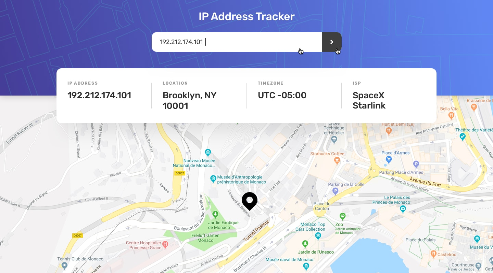

# IP Address Tracker

A high-performance, full-stack IP Address Tracker that delivers real-time geolocation mapping with a sleek, responsive UI. By coupling a React, TypeScript, and Tailwind frontend with a dedicated Node/Express proxy, this application resolves any IP or domain and instantly flies to its location on an interactive Leaflet map.

## Visualizing the Experience

**Desktop Layout**


**Mobile Layout**


**Interactive States & UI Feedback**


## Key Features & Architecture

- **Real-Time Geolocation:** Instantly resolves any valid IP address or domain to its physical coordinates and UTC offset using a seamless fetch pipeline.
- **Custom Proxy Backend:** A dedicated Node/Express proxy handles API routing securely, preventing cross-origin resource sharing (CORS) errors and masking upstream provider details.
- **Responsive Design System:** Fluidly adapts from mobile viewports to wide desktop monitors, utilizing Tailwind CSS for a scalable and maintainable design language.
- **Dynamic State Management:** Provides a polished user experience with loading skeletons, animated map markers featuring a custom "radar ping," and graceful error handling for invalid queries.
- **Clean Workspace Structure:** Houses both the client and server environments in a single repository, streamlining local development with concurrent execution.

## Getting Started

1. **Install**
  Clone the repository locally and install all required dependencies for both environments in one command:
  ```bash
    git clone [https://github.com/ezekiel673/ip-address-tracker.git](https://github.com/ezekiel673/ip-address-tracker.git)
    cd ip-address-tracker
    npm run install:all
  ```

2. **Configure environment variables**
Copy the example env files. Nothing needs editing to run locally — the default lookup provider is free and keyless.

```bash
  cp server/.env.example server/.env
  cp client/.env.example client/.env
```

3. Run it
Launch the concurrent development environment:

```bash
npm run dev
```
Explore the live application at http://localhost:5173 while the backend proxy listens on port 4000.

4. **Troubleshooting**
- Map tiles don't load / CORS errors: OpenStreetMap's public tile servers are used as-is; if you're rate-limited, swap the TileLayer URL in MapView.tsx for Mapbox or Google Maps.

- "Could not locate that address": Free lookup providers often can't resolve private/reserved IP ranges (e.g. 192.168.x.x). Try a public IP or a domain like github.com.

- Port already in use: change PORT in server/.env and VITE_API_BASE_URL in client/.env to match.